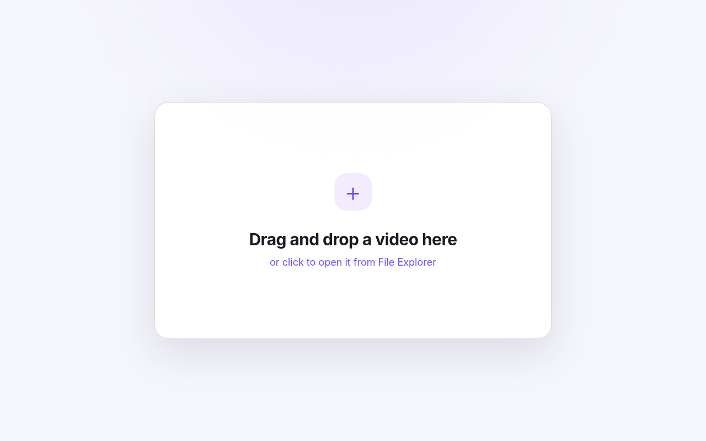

# GBA Video Maker

A portable Windows app that turns an ordinary video into a self-playing Game Boy Advance ROM.



The app starts with a simple drag-and-drop screen. After the video is inspected, it exposes trimming, speed, framing, audio, frame-rate, looping, ROM-title, and output controls.

## Download

Open the repository's **Releases** page, download the latest portable ZIP, extract it, and run `GBA Video Maker.exe`.

No installer, Python runtime, administrator access, or devkitARM setup is required. Microsoft Edge or Google Chrome is used for the local app window. The executable falls back to the default browser when neither app-mode browser is available.

On first use, the app can download a pinned Windows x64 FFmpeg executable and verify its SHA-256 checksum. You can instead place your own `ffmpeg.exe` beside the app.

> Windows may warn about an unsigned executable. Build it from source when you prefer not to run a downloaded binary.

## Features

- Drag and drop, or click to select a video
- Trim start and end times
- Playback speed from 0.5× to 3×
- Crop, fit with bars, or stretch to the GBA screen
- Mixed mono, left channel, right channel, or no audio
- Volume adjustment
- Multiple frame-rate presets
- Optional looping
- Editable 12-character GBA ROM title
- ROM-size estimate with a 32 MiB compatibility limit
- One-click `.gba` output
- Pause/resume, mute, playback HUD, five-second seeking, and restart controls inside the generated ROM

## Generated ROM format

The current encoder prioritizes reliability and straightforward playback:

- GBA display: 240×160
- Encoded source frames: 120×80, expanded 2× by the player
- Indexed video using 250 source colours plus six reserved HUD colours
- Signed 8-bit mono audio at 16,384 Hz
- Power-of-two ROM padding, up to 32 MiB
- Frame-synchronised playback with audio seek offsets

The exact duration that fits depends on frame rate and whether audio is enabled. Low-motion footage generally looks better at the same size than noisy footage.

## ROM controls

| Button | Action |
|---|---|
| `A` | Pause or resume |
| `L` or `D-pad Left` | Seek backward approximately 5 seconds |
| `R` or `D-pad Right` | Seek forward approximately 5 seconds |
| `SELECT` | Mute or unmute audio |
| `D-pad Up` | Show or hide the playback HUD |
| `B` or `START` | Restart the video |

Mute/unmute and seek feedback disappear after about 0.4 seconds. The playback HUD remains visible while the video is paused, and `D-pad Up` can still pin or hide it manually. Muting or unmuting does not automatically pop open the playback HUD. The unmuted badge uses a compact green check-style mark.

## Privacy model

The GUI is served by the executable on a random loopback address under `127.0.0.1`. A random per-session token is included in API paths. Video processing happens locally through FFmpeg; selected videos are not uploaded to a remote service.

Temporary files are created in the operating system's temporary directory and removed when the session closes normally.

## Build from source

Requirements:

- Go 1.23 or newer
- FFmpeg only for the integration test and local conversions
- LLVM (`clang`, `ld.lld`, and `llvm-objcopy`) only when rebuilding the embedded GBA player

Run checks:

```bash
go fmt ./...
go vet ./...
go test -race ./...
```

Rebuild the embedded GBA player after changing files under `player/`:

```bash
./player/build.sh
```

Build the portable Windows executable from Windows, Linux, or macOS:

```bash
GOOS=windows GOARCH=amd64 CGO_ENABLED=0 \
  go build -trimpath -ldflags="-H windowsgui -s -w" \
  -o "GBA Video Maker.exe" .
```

On PowerShell:

```powershell
./scripts/build-windows.ps1
```

Create a release ZIP:

```powershell
./scripts/package-release.ps1 -Version 0.7.0
```

## Project layout

```text
player/                  GBA playback-engine source and build scripts
assets/player_stub.bin   Prebuilt embedded GBA playback engine
converter.go             FFmpeg pipeline and ROM assembly
webapp.go                Local HTTP API and embedded GUI
main_windows.go          Windows app-window launcher
main_other.go            Command-line test harness for non-Windows systems
process_*.go              Platform-specific process execution
webapp_test.go            Unit and end-to-end tests
.github/workflows         CI and tagged-release automation
```

More implementation detail is available in [`docs/ARCHITECTURE.md`](docs/ARCHITECTURE.md).

## FFmpeg

FFmpeg is a separate open-source project distributed under its own licenses. It is not committed to this repository. See [`THIRD_PARTY_NOTICES.md`](THIRD_PARTY_NOTICES.md).

## Legal note

Convert only video and audio you have permission to use. Game Boy Advance, Nintendo, and related marks belong to their respective owners. This project is independent and is not affiliated with or endorsed by Nintendo.

## License

The application source is available under the [MIT License](LICENSE).


The playback HUD leaves a black 1-pixel row above and below the loop icon so it sits cleanly above the progress line.


The seek popup now uses a tighter 2-pixel gap between the number and arrow to keep the box less intrusive.


`D-pad Left/Right` now mirror `L/R` for five-second seeking, so either control style works.
