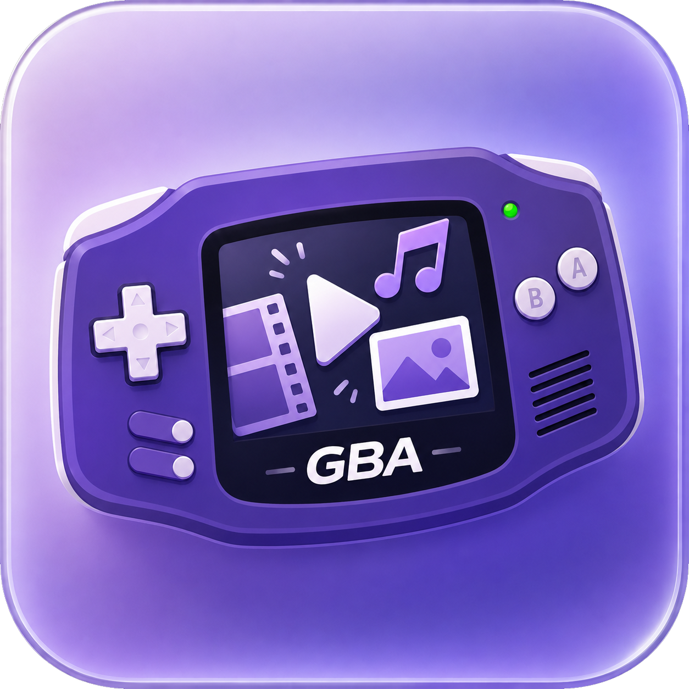

<div align="center">
  

# GBA Media Maker

**Turn videos, music, animated GIFs, and images into playable Game Boy Advance ROMs — on Windows or in the browser.**

[](CHANGELOG.md) [](https://draconov.github.io/gba-media-maker/) [](https://github.com/Draconov/gba-media-maker/releases/latest) [](LICENSE)
</div>

## Choose your version

| | Browser edition | Portable desktop app |
|---|---|---|
| Installation | None after deployment | Extract the release ZIP and run the EXE |
| Processing | Local in the browser with ffmpeg.wasm | Local with native FFmpeg |
| Best for | Quick jobs and normal-size projects | Long videos, repeated jobs, and maximum speed |
| Media/project model | v0.13.1 parity | Reference implementation |
| Privacy | Source media stays on your device | Source media stays on your device |
| Platform | Modern desktop browsers | Windows x64 |
| Documentation | [Website guide](website/README.md) | This README |

The browser edition has the same current media model, ROM format, output naming, menu/theme tools, title cards, audio-artwork modes, and player runtime as the desktop app. Browser memory and file-access limits still make the desktop build preferable for very large sources.

## What it can create

- A normal single-media `.gba` ROM
- A **media-menu ROM** containing two or more videos, GIFs, songs, and/or images
- A menu ROM containing only one media type, such as a music collection or image gallery
- Separate `.gba` files packaged into a ZIP
- Numbered ROM parts for a single long video that cannot safely fit on one cartridge

For new projects, **every collection with two or more items uses the media menu** unless Separate ROMs is selected. A one-item project opens directly without a menu.

## Media support

### Video

Video keeps the established 120×80 indexed pipeline and expands to the GBA's 240×160 display.

- Common FFmpeg-supported containers such as MP4, MKV, MOV, AVI, and WebM
- Start/end trimming and playback-speed control
- Fit with bars, crop to fill, or stretch
- Smooth, Balanced, Classic, and Compact GBA frame-rate choices
- Shared or scene-change palettes
- Dithering off, ordered, or error diffusion
- Keyframe/delta compression or uncompressed video
- Automatic raw-frame fallback when compression is larger
- Configurable seek step
- Optional looping
- Per-source audio-stream selection
- Mono mix, left channel, right channel, or **No audio**
- Per-item volume, normalization, limiter, PCM, and experimental IMA ADPCM
- Optional save/resume position
- Automatic long-video splitting and native split-part title cards
- Extreme optimization remains available as an experimental preset

### Animated GIF

Animated GIFs use the video pipeline rather than the static-image pipeline.

- Imported through the normal media picker
- Encoded as animated video frames
- Native ROM looping is enabled automatically
- No volume or mute controls because GIF entries contain no audio

### Music / audio

Audio-only media uses a native 240×160 artwork screen and the GBA Now Playing UI.

- Common FFmpeg-supported formats such as MP3, WAV, FLAC, OGG/Opus, M4A, and AAC
- Editable **28-character song title** and **28-character artist** fields
- Source album metadata retained in the compact media metadata record
- Start/end trimming and playback-speed control
- 16,384 Hz mono signed 8-bit PCM, with optional experimental block IMA ADPCM
- Pause/resume, seeking, looping, volume, mute, HUD modes, and save/resume
- Full Now Playing HUD is visible when audio playback starts
- Seek, volume, and mute feedback update only the HUD regions; artwork is not blanked/redrawn for ordinary controls

#### Audio artwork

Each audio item has three artwork sources:

1. **Embedded artwork** — uses cover art from the source when available; otherwise falls back to the selected default preset.
2. **Default artwork** — forces one of the 20 built-in 240×160 presets.
3. **Custom image** — accepts PNG, JPEG, or WebP and crops it to the GBA screen.

All artwork is stored in the ROM as native 240×160 RGB555 pixels.

### Images

Static images bypass video quantization and are stored directly as a 240×160 RGB555 screen.

- PNG, JPEG, WebP, BMP, TIFF, and other image formats supported by the active FFmpeg build
- Fit with bars, crop to fill, or stretch
- **Enable slideshow** with a configurable duration
- Disable slideshow for a manual image viewer
- Images never expose mute or volume controls
- `A` pauses/resumes only an enabled slideshow; it does nothing in manual-viewer mode

## Media menu design

Collection ROMs use the restored stable v0.12.2 menu/theme engine with v0.13 media labels and behavior.

- Live 120×80 preview using the same optimized data embedded in the ROM
- Exact 3×5 GBA font, divider lines, coordinates, and pixel-art selection arrow
- `[V]`, `[A]`, and `[I]` media tags
- **Classic dark**, **Ocean Wave — static**, **Ocean Wave — animated**, and **Blue Wave — animated** backgrounds
- Custom PNG, JPEG, WebP, GIF, or video backgrounds
- GIF/video backgrounds sampled into at most 16 looping MTH1 frames
- Full custom GBA colour picker with saturation/value field, hue strip, RGB/HEX editing, eyedropper, and preset swatches
- Separate UI text, selection, and outline colours
- Optional one-pixel outline
- Column/page navigation with D-pad Up/Down/Left/Right
- Remembered menu selection when save/resume is enabled

Menu-theme data is embedded in the ROM, so exported collection ROMs are self-contained.

## Native title cards for split videos

Long-video parts can show a pre-rendered 240×160 title card before playback.

- First frame of the part, solid colour, or other configured background
- Adjustable darkening
- Independent title/subtitle size, alignment, text colour, and outline colour
- Shared settings or per-part overrides
- Wait for `A` or start after a timer
- Optional skip and fade
- Pixel-accurate RGB555 preview in desktop and browser editions

## Latin and Cyrillic text

GBA Media Maker keeps the shared Latin + Ukrainian/Russian 3×5 font introduced in v0.12.2.

- Ukrainian support including `Ґ Є І Ї`
- Russian support including `Ё Ъ Ы Э`
- Mixed Latin/Cyrillic menu titles and title cards
- UTF-8 project files
- Limits measured in visible glyphs instead of UTF-8 bytes
- Common typographic punctuation normalization
- Unsupported-character reporting
- ASCII-safe cartridge-header transliteration

## Generated ROM controls

### Video

| Button | Action |
|---|---|
| `A` | Pause / resume |
| `B` | Return to the media menu in menu ROMs; restart in a direct single-media ROM |
| `L` / `R` | Previous / next media |
| D-pad `Left` / `Right` | Seek while playing; step one video frame while paused |
| Hold D-pad `Left` / `Right` | Repeat the current seek/step action about every **0.3 seconds** |
| D-pad `Up` / `Down` | Volume 0% / 50% / 100% **only when the video actually has audio** |
| `SELECT` | Mute / unmute **only when the video actually has audio** |
| `START` | Cycle HUD: hidden → time only → full |
| `START + SELECT` | Open the controls-help screen |

The v0.12.2-style video HUD is retained, including elapsed/total time, progress, frame counter, loop icon, and seek feedback. GIFs, silent videos, and videos converted with **No audio** do not expose volume or mute controls.

### Music / audio

| Button | Action |
|---|---|
| `A` | Pause / resume |
| `B` | Return to the media menu in menu ROMs; restart in a direct single-media ROM |
| `L` / `R` | Previous / next media |
| D-pad `Left` / `Right` | Seek while playing; move one timeline step while paused |
| Hold D-pad `Left` / `Right` | Repeat the current seek/step action about every **0.3 seconds** |
| D-pad `Up` / `Down` | Volume 0% / 50% / 100% |
| `SELECT` | Mute / unmute |
| `START` | Cycle HUD: hidden → time only → full |
| `START + SELECT` | Open the controls-help screen |

Audio tracks use one of the 20 built-in covers automatically for new imports unless you choose embedded or custom artwork. When an audio HUD is visible, its panel darkens the cover underneath instead of replacing that part with solid black, so the complete cover remains visible edge-to-edge.

### Image viewer

| Button | Action |
|---|---|
| `A` | Pause / resume only when slideshow is enabled |
| `B` | Return to the media menu in menu ROMs; restart in a direct single-image ROM |
| `L` / `R` | Previous / next media |
| `START` | Toggle image HUD: hidden ↔ shown |
| `START + SELECT` | Open the controls-help screen |

Images start with the HUD hidden and have only two HUD states: hidden and shown. Images have no seeking, mute, or volume controls. `A` does nothing when slideshow is disabled.

### Media menu

| Button | Action |
|---|---|
| D-pad `Up` / `Down` | Move within the current column |
| D-pad `Left` / `Right` | Move between columns/pages |
| `A` | Play the selected media |
| `START + SELECT` | Open menu controls help |

### Temporary playback feedback

Mute/unmute, volume, seek-arrow feedback, and the temporary full HUD after a seek are each displayed for **6 VBlanks (~0.10 s)**. Held seek/step repetition remains **18 VBlanks (~0.30 s)**.

The old redundant `SELECT + L/R` media shortcut and `L + R` quick-HUD shortcut are not used in v0.13.1.

## Save/resume support

When **Save/resume position** is enabled, the runtime stores the selected menu item and a separate playback position for playable timeline media.

When a valid saved video/audio position exists, the v0.12.2-style confirmation screen is shown:

```text
CONTINUE FROM
    MM:SS

 A CONTINUE
 B RESTART
```

- `A` continues from the saved position.
- `B` clears that saved position and restarts the current media.
- Static images do not show a resume-time prompt.
- Completing media normally clears its saved playback position.

Save behavior should be tested on the intended emulator/flash cartridge because SRAM handling can vary by environment.

## Output modes and filenames

Desktop and browser editions use the same current naming rules.

| Project | Output example |
|---|---|
| One source | `My Movie.gba` |
| Two or more items, media menu | `GBA_Media_Collection.gba` |
| Two or more items, Separate ROMs | `GBA_Media_Collection.zip` |
| ROM inside Separate ROMs ZIP | `My Song_GBA.gba` |
| Long-video archive | `My Movie_PARTS.zip` |
| Long-video ROM part | `My Movie_PART_01.gba` |
| Long-video manifest | `PARTS.txt` |
| Project file | `My Project.gbamedia` |

Browsers may add their own `(1)`, `(2)`, and similar suffixes when downloading a filename that already exists locally; that is browser/OS behavior, not a GBA Media Maker naming rule.

## Project files

Current projects use:

```text
extension: .gbamedia
format:    gba-media-maker-project
version:   2
```

Version 2 stores the mixed-media model, per-item settings, image slideshow state, music metadata, artwork source/preset/custom artwork, menu theme, title cards, and current encoding settings.

Legacy `.gbavideo` v1 project files remain loadable. Legacy playlist output values are upgraded to the current media-menu behavior.

Browser security does not allow a saved project to silently reopen arbitrary local source files. After opening a project in the website, source media may need to be selected again and relinked.

## Desktop app

Download the portable ZIP from the repository's **Releases** page, extract it, and run:

```text
GBA Media Maker.exe
```

Official portable packages place a pinned Windows x64 `ffmpeg.exe` beside the application. No installer, Python runtime, administrator access, or devkitARM installation is required.

The desktop interface is served only on `127.0.0.1` with a random per-session token. FFmpeg processing is local; source media is not uploaded to an external conversion service.

> [!NOTE]
> Windows may warn about an unsigned executable. Building from source or signing release binaries is the reliable way to establish publisher trust.

## Browser app

The standalone browser edition lives under [`website/`](website/) and has v0.13.1 feature/naming parity with the desktop media workflow.

It uses ffmpeg.wasm for local media processing and synchronizes the same 32 KiB `assets/player_stub.bin` into the website build, so desktop and browser ROMs use the same GBA playback runtime.

See [`website/README.md`](website/README.md) for local development, GitHub Pages deployment, browser limitations, and project relinking details.

## ROM format

| Property | Value |
|---|---|
| Container metadata | `GBV5`, version 5 |
| GBA player area | 32 KiB (`0x0000`–`0x7FFF`) |
| Global metadata | 64 bytes at `0x7FC0` |
| Media assets | Start at `0x8000` |
| Video display path | Mode 4, 120×80 indexed source expanded to 240×160 |
| Audio artwork / images | Mode 3, native 240×160 RGB555 |
| Video palette | RGB555, with reserved runtime UI entries |
| Audio | Signed 8-bit mono PCM at 16,384 Hz; optional experimental IMA ADPCM |
| Audio metadata | `MMD2`: 28-char title, 28-char artist, 20-char album |
| Menu themes | `MTH1` |
| Native title cards | `TCD1` |
| Maximum cartridge image | 32 MiB |
| Minimum/padding | At least 1 MiB, padded to the next power-of-two cartridge size |
| New GBA game code | `GM05` |

v0.13.0 extends the existing 96-byte GBV5 clip descriptor with previously unused flag bits for audio-only, image, and media-metadata entries. The container version was intentionally not bumped, so legacy GBV5 video descriptors remain compatible with the current player.

More implementation detail is available in [`docs/ARCHITECTURE.md`](docs/ARCHITECTURE.md).

## Privacy and security

### Desktop

- Loopback-only local server (`127.0.0.1`)
- Random per-session API token
- Local FFmpeg processing
- Upload-size limits and temporary session workspace
- Pinned FFmpeg release with SHA-256 archive verification in official packaging
- No runtime executable downloader in the portable release

### Browser

- Static site; there is no project media-upload backend
- Conversion runs inside the browser with WebAssembly
- Source files remain local to the browser's file/FFmpeg virtual filesystem
- The FFmpeg WebAssembly core is loaded as part of the browser conversion stack

See [`SECURITY.md`](SECURITY.md) for vulnerability-reporting guidance.

## Build from source

Clone the current repository first:

```bash
git clone https://github.com/Draconov/gba-media-maker.git
cd gba-media-maker
```

### Requirements

- Go 1.23 or newer
- FFmpeg for conversions and generated-media integration tests
- LLVM tools (`clang`, `ld.lld`, `llvm-objcopy`) to rebuild the GBA player
- Node.js 22 and npm for the browser edition

### Test the core/desktop code

```bash
go fmt ./...
go vet ./...
go test -race ./...
```

FFmpeg-backed integration tests run when FFmpeg is available on `PATH`.

### Rebuild the GBA player

After changing `player/`:

```bash
./player/build.sh
```

PowerShell:

```powershell
./player/build.ps1
```

`assets/player_stub.bin` must remain exactly **32,768 bytes**.

### Build the Windows executable

```bash
GOOS=windows GOARCH=amd64 CGO_ENABLED=0 \
  go build -trimpath -buildvcs=false \
  -ldflags="-H windowsgui -s -w" \
  -o "GBA Media Maker.exe" .

go run ./tools/embedicon \
  -exe "GBA Media Maker.exe" \
  -ico "assets/icon.ico"
```

PowerShell helpers:

```powershell
./scripts/build-windows.ps1
./scripts/package-release.ps1 -Version 0.13.1
```

### Run/build the website

```bash
cd website
npm install
npm test
npm run dev
```

Production build:

```bash
cd website
npm run build
npm run preview
```

The website pre-test/pre-build hooks synchronize `../assets/player_stub.bin` into `website/public/player_stub.bin` automatically.

## Project layout

```text
assets/
├── player_stub.bin        authoritative 32 KiB GBA runtime
└── audio-artwork/         20 built-in 240×160 audio artwork presets

player/                    freestanding ARM7TDMI player source/build scripts
converter.go               desktop media conversion and GBV5 ROM assembly
audio_artwork.go           built-in/custom/embedded audio artwork handling
menu_theme.go              MTH1 menu-theme validation/embedding
title_card.go              native 240×160 TCD1 title-card rendering
smart_encoding.go          Extreme optimization analysis/recommendation logic
web/                       embedded desktop HTML/CSS/JavaScript UI
webapp.go                  local desktop HTTP API and conversion coordination
website/                   browser converter, ffmpeg.wasm pipeline, tests, Pages build
scripts/                   Windows build, FFmpeg fetch, and release helpers
tools/embedicon/           Windows executable icon embedding
docs/                      architecture documentation
.github/workflows/         CI, release, and GitHub Pages workflows
```

## FFmpeg, artwork, and legal notes

FFmpeg and browser FFmpeg components are separate open-source projects distributed under their own licences. The 20 bundled audio-artwork presets are third-party artwork supplied under a separate redistribution licence and remain subject to that separate artwork licence. See [`THIRD_PARTY_NOTICES.md`](THIRD_PARTY_NOTICES.md).

Convert and redistribute only media/assets you have permission to use. Game Boy Advance, Nintendo, and related marks belong to their respective owners. This independent project is not affiliated with or endorsed by Nintendo.

## Documentation

- [Release history](CHANGELOG.md)
- [Architecture](docs/ARCHITECTURE.md)
- [GBA player](player/README.md)
- [Browser edition](website/README.md)
- [Contributing](CONTRIBUTING.md)
- [Security policy](SECURITY.md)
- [Third-party notices](THIRD_PARTY_NOTICES.md)

## License

GBA Media Maker is distributed under the [GBA Media Maker Non-Commercial Contribution License v1.0](LICENSE). It permits personal, educational, research, hobby, and contribution-focused non-commercial use, while restricting commercial use and redistribution. Third-party components and assets remain subject to their own licences as described in [`THIRD_PARTY_NOTICES.md`](THIRD_PARTY_NOTICES.md).
